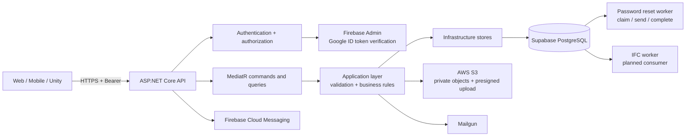
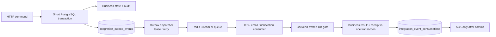

# BE runtime and target architecture

Use [Docs technology](../../Docs/fire-evacuation-training-technology.md), [workflows](../../Docs/fire-evacuation-training-workflows.md) and [schema](../../Docs/fire_evacuation_schema.sql) as the target contract. Diagrams below label current code separately from target behavior; an architecture diagram is not proof a worker/provider is deployed.

## HTTP response rules

`POST` does not automatically mean `201`.

| Operation type | Status | Fire3D examples |
|---|---:|---|
| Creates a new resource synchronously | `201 Created` with `Location` | register, create account/organization/building/scenario/draft/snapshot/playtest, initiate IFC upload, create review |
| Requests durable asynchronous work | `202 Accepted` with a polling location | process IFC revision, retry failed processing job, forgot password |
| Runs an action on an existing resource | `200 OK` or `204 No Content` | login, refresh, validate draft, publish/start/confirm, logout, reset password, upload-complete |

`POST /api/buildings/{buildingId}/ifc` creates a revision before it returns the presigned upload URL, therefore it returns `201 Created` and `Location: /api/revisions/{revisionId}`.

## Current runtime architecture



The API is the only public entry point. Clients never receive database, Redis, S3, Firebase Admin, or Mailgun credentials. Authorization reloads role, organization and active state from PostgreSQL; it does not trust a tenant or role from the request body.

## Current IFC API path — partial implementation

```mermaid
sequenceDiagram
    participant C as Client
    participant A as API + MediatR
    participant D as PostgreSQL
    participant S as S3

    C->>A: POST /buildings/{id}/ifc
    A->>D: create revision
    A->>S: create presigned PUT URL
    A-->>C: 201 revision + upload URL
    C->>S: upload IFC directly
    C->>A: POST /revisions/{id}/upload-complete
    A->>S: verify object size
    A->>D: create source document
    A-->>C: 204
    C->>A: POST /revisions/{id}/process
    A->>D: create job + audit + outbox event
    Note over A,D: Current source writes placeholder payload_hash; verify/fix before v6.7 contract use
    A-->>C: 202 /processing-jobs/{jobId}
    C->>A: GET job, QA, issues, artifacts, logs
    A->>D: tenant-scoped read
    A-->>C: persisted status/result (does not prove a worker ran)
```

The API creates a durable job/outbox record, but this does not establish that an outbox dispatcher or production IFC consumer is running. The current BE store still writes a placeholder payload hash. Treat processing/QA output as unavailable until the event contract is valid and a worker is connected and verified.

## Event-driven target

An external call must never run inside an open PostgreSQL transaction. A command writes its aggregate, audit record, and an immutable outbox envelope in one short transaction. A dispatcher then publishes it; a consumer records its receipt and business effect in one transaction before acknowledging the message.



The processing worker claims its attempt/lease through the backend and registers artifact/validation/issues through the lease-bound gate such as `register_processing_output`. It does not write protected provenance tables directly. This target follows the event and recovery contract in Docs technology; it is not evidence that the full dispatcher/consumer/gates run in the current environment.

### Migration order

1. Keep existing synchronous resource creation transactional with its audit record.
2. Standardize `ProcessingJobRequested` and `ProcessingJobRequeue` outbox envelopes: event ID, aggregate ID, tenant-derived scope, schema version, canonical payload hash and idempotency key.
3. Add a dispatcher that leases outbox rows, publishes them, and retries without exposing a queue to clients.
4. Add an IFC consumer that claims a processing attempt through the database gate, then commits artifacts, BIM facts, QA/progress and an idempotent consumption receipt through the authorized result path before ACK. Keep the business effect and receipt atomic.
5. Move email and FCM delivery to the same pattern. Password reset already uses a durable queue/worker pattern and is the reference for worker retries.
6. Add integration tests for duplicate delivery, consumer crash after effect/before ACK, stale lease, tenant isolation and outbox retry.

The current IFC process path creates the processing job, audit record and `ProcessingJobRequested` outbox row in one transaction, but its payload hash is a placeholder. It still needs the canonical envelope/hash, real dispatcher/consumer and gate-backed result path before it can be treated as a completed event-driven pipeline. For the task-by-task gaps and acceptance criteria, use the [BE implementation checklist](api-implementation-checklist.md).
