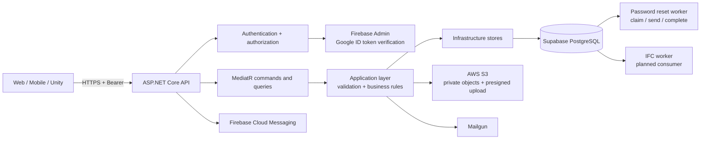
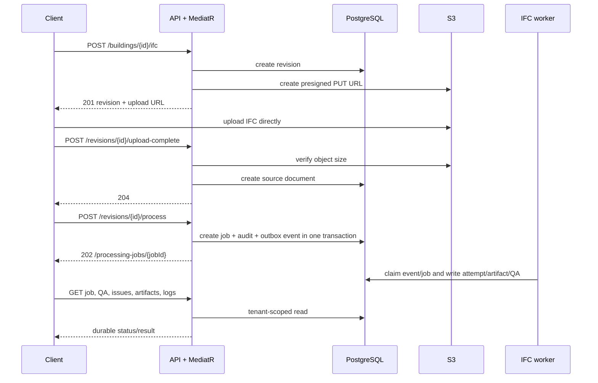
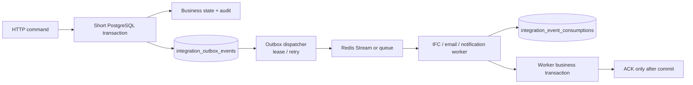

# Fire3D BE architecture and event-driven migration

## HTTP response rules

`POST` does not automatically mean `201`.

| Operation type | Status | Fire3D examples |
|---|---:|---|
| Creates a new resource synchronously | `201 Created` with `Location` | register, create account/organization/building/scenario/draft/snapshot/playtest, initiate IFC upload, create review |
| Requests durable asynchronous work | `202 Accepted` with a polling location | process IFC revision, retry failed processing job, forgot password |
| Runs an action on an existing resource | `200 OK` or `204 No Content` | login, refresh, validate draft, publish/start/confirm, logout, reset password, upload-complete |

`POST /api/buildings/{buildingId}/ifc` creates a revision before it returns the presigned upload URL, therefore it returns `201 Created` and `Location: /api/revisions/{revisionId}`.

## Current runtime architecture

The API is the only public entry point. Clients never receive database, Redis, S3, Firebase Admin, or Mailgun credentials. Authorization reloads role, organization and active state from PostgreSQL; it does not trust a tenant or role from the request body.

## Current API communication flow

## Event-driven target

An external call must never run inside an open PostgreSQL transaction. A command writes its aggregate, audit record, and an immutable outbox envelope in one short transaction. A dispatcher then publishes it; a consumer records its receipt and business effect in one transaction before acknowledging the message.

### Migration order

1. Keep existing synchronous resource creation transactional with its audit record.
2. Standardize `ProcessingJobRequested` and `ProcessingJobRequeue` outbox envelopes: event ID, aggregate ID, tenant-derived scope, schema version, canonical payload hash and idempotency key.
3. Add a dispatcher that leases outbox rows, publishes them, and retries without exposing a queue to clients.
4. Add an IFC consumer that claims a processing attempt through the database gate, records an idempotent consumption receipt, then writes artifacts, BIM facts, QA and progress logs.
5. Move email and FCM delivery to the same pattern. Password reset already uses a durable queue/worker pattern and is the reference for worker retries.
6. Add integration tests for duplicate delivery, consumer crash after effect/before ACK, stale lease, tenant isolation and outbox retry.

The current IFC process path already creates the processing job, audit record and `ProcessingJobRequested` outbox row in one transaction. It still needs a real dispatcher/consumer and schema-level validation of the event envelope before it can be treated as a completed event-driven pipeline.
